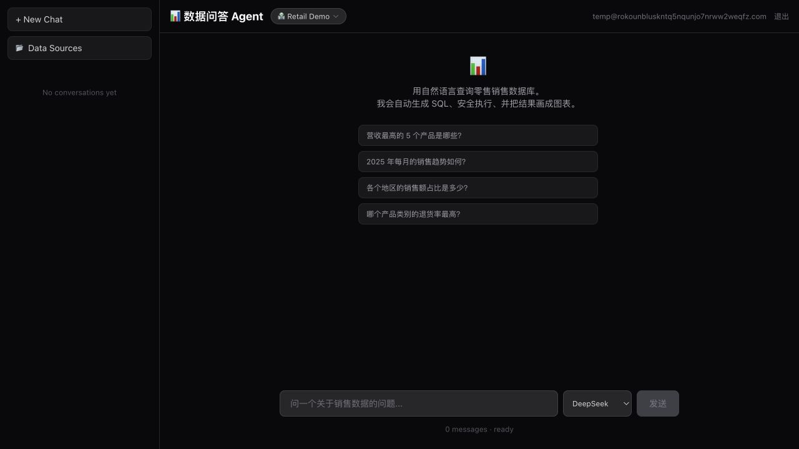

# Self-Service AI Data Workspace

[简体中文](README.md) · **English**

[](https://github.com/LeoGGG1234/text-to-sql-agent/actions/workflows/ci.yml)
[](https://text-to-sql-agent-staging.vercel.app)
[](https://nextjs.org/)
[](https://www.typescriptlang.org/)

> Ask business questions in natural language. The agent generates PostgreSQL, executes it through a read-only security boundary, self-corrects bounded failures, and visualizes the result.

This is an end-to-end AI data application for uploading, profiling, cleaning, and querying relational data in English or Chinese. Its engineering focus is not merely producing plausible SQL: it treats model-generated SQL as untrusted code, keeps destructive cleaning behind an explicit preview/commit boundary, and makes answer quality executable.

**[Live Demo](https://text-to-sql-agent-staging.vercel.app)** · **[GitHub Actions](https://github.com/LeoGGG1234/text-to-sql-agent/actions/workflows/ci.yml)** · **[Engineering Case Study](docs/PORTFOLIO_CASE_STUDY.md)**



## Try it in 30 seconds

The live demo supports isolated guest sessions with no sign-up required. Try:

- `Which five products generated the most revenue?`
- `Show the monthly sales trend for 2025.`
- `What share of sales came from each region?`

The UI exposes the SQL tool trace, result table, explanation, and chart. Guests, conversations, and uploaded data sources are isolated by ownership checks.

To reproduce the complete upload → profile → clean → analyze story, use the repository's [frozen synthetic fixture](docs/demo-data/dirty-sales-orders.csv), its [executable oracle](docs/demo-data/README.md), and the [90-second demo script](docs/DEMO_SCRIPT.md).

## Highlights

- **Natural language to PostgreSQL** — bilingual business questions, schema-aware SQL generation, execution, and explanation.
- **Defense-in-depth SQL execution** — ownership checks, a physical-table allowlist, AST validation, hardened read-only roles, a 1,000-row cap, and a 5-second timeout.
- **Bounded self-correction** — structured error codes guide schema lookup and SQL rewriting without infinite retry loops.
- **User-owned data** — CSV/XLSX upload, type inference, data-quality analysis, paginated preview, and conversation-level data-source binding.
- **Deterministic cleaning policies** — inspectable recipes, conservative/standard/aggressive presets, full-table dry runs, before/after samples, explicit apply, revision-conflict protection, post-clean validation, and run history.
- **Traceable visualization** — the agent selects a chart and result columns, while the server builds bar, line, and pie data only from the referenced SQL result.
- **Multi-provider routing** — DeepSeek, OpenAI, Anthropic, Gemini, and OpenRouter through the Vercel AI SDK.
- **Execution-based evals** — generated and reference SQL are executed against the same database and their result sets are compared.

## System flow

```text
CSV / XLSX upload
    ↓
Schema inference → Quality profile → Data preview/edit
    ↓
Cleaning recipe → Dry-run diff → Explicit apply → Validation
    ↓
User question (English / Chinese)
    ↓
Next.js chat UI (streaming responses + tool traces)
    ↓
/api/chat
    ├── Better Auth / isolated Guest identity
    ├── conversation ownership check
    ├── data-source ownership check
    ├── provider selection and rate limit
    └── schema resolved from the authorized data source
    ↓
streamText (maxSteps: 5)
    ├── runSql      → validate and execute one read-only SELECT
    ├── getSchema   → reload tables, columns, and relationships
    └── renderChart → bind a resultId to real SQL rows and build the chart spec
    ↓
Authorized data source
    ├── Retail demo database (retail_readonly)
    └── Uploaded table (userdata_readonly + physical-table allowlist)
```

## Security model

Model-generated SQL is untrusted. The project applies separate controls at the resource, query, and database boundaries.

| Boundary | Control | Risk contained |
|----------|---------|----------------|
| Conversation | Every read and update is scoped by `id + userId` | Access through a known conversation ID |
| Data source | Ownership-aware lookup before binding and every later reuse | Binding or querying another user's upload |
| Tenant SQL | The authorized data source produces a physical-table allowlist | Reading a neighboring table in the shared `userdata` schema |
| SQL AST | Exactly one `SELECT`; per-operation `tableList` validation; system tables, dangerous functions, comments, multiple statements, and `SELECT INTO` are rejected | Injection and write-capable SQL, including data-modifying CTEs |
| Resource usage | AST-injected 1,000-row limit plus a 5-second statement timeout | Unbounded result sets and expensive queries |
| PostgreSQL | Hardened read-only roles; the shared `userdata_readonly` role is not treated as tenant read isolation | An application-validator bypass becoming a write primitive; tenant reads still depend on the physical-table allowlist |

The validator is implemented in [`src/lib/sql-validator.ts`](src/lib/sql-validator.ts), and execution is implemented in [`src/lib/sql-executor.ts`](src/lib/sql-executor.ts).

### Adversarial bug found during development

The first validator checked only `stmt.type === 'select'`. PostgreSQL data-modifying CTEs such as `WITH t AS (UPDATE ... RETURNING *) SELECT * FROM t` still present a top-level `SELECT`, so the fix validates every operation reported in `tableList`. A later review found that XML mapping functions such as `query_to_xml_and_xmlschema` can hide a query inside a string argument that the AST table scope cannot see; the full XML mapping family is now rejected, including nested and schema-qualified variants. Regression tests preserve both findings. The database role is the final write boundary, while tenant read isolation still depends on the physical-table allowlist.

## Bounded self-correction

`runSql` returns structured failures that map to explicit recovery actions inside the same tool-call budget:

| Error | Recovery action |
|-------|-----------------|
| `UNKNOWN_COLUMN` | Call `getSchema`, then rewrite with the real column name |
| `SYNTAX_ERROR` | Simplify and correct the query |
| `TIMEOUT` | Narrow the query with filters or limits |
| `VALIDATION_ERROR` | Rewrite the request as one allowed `SELECT` |

The agent stops after three consecutive SQL failures. A successful query resets the failure budget.

## Data sources

The built-in retail demo contains six related tables and roughly 25,000 deterministic synthetic rows:

`customers` · `categories` · `regions` · `products` · `orders` · `order_items`

Users can also upload CSV or XLSX files. Legacy `.xls` is rejected with an explicit conversion message because its previous parser carried unresolved security advisories. The upload path:

1. parses and normalizes column names;
2. infers useful numeric/date cast hints while storing raw cells as text;
3. computes data-quality signals;
4. creates an isolated physical table;
5. grants the runtime role `SELECT` on that table only;
6. binds the owned data source to a conversation after authorization.

Default upload limits are 80 MB and 50,000 rows. The file-size limit is configurable, while the row limit can only be configured downward; upload, cleaning, and export intentionally share the same 50,000-row ceiling for the current serverless implementation.

## Data quality and cleaning

Every uploaded source stores a quality profile together with a data revision. Inline edits, row insertion, and row deletion update the physical table and metadata atomically, increment the revision, and mark the profile stale. A re-profile uses optimistic revision checking, so it cannot publish statistics calculated over a concurrently changed table. Stale statistics are never injected into the Agent prompt.

Cleaning follows an explicit, non-LLM execution boundary:

```text
Preset or structured recipe
    → deterministic TypeScript executor
    → full-table preview and representative diff
    → user confirmation
    → transactional apply
    → before/after quality validation and history
```

The current recipe vocabulary covers whitespace/full-width normalization, configurable NULL markers, numeric/currency/percentage parsing, calendar-valid unambiguous date normalization, missing-value handling, and exact or key-based deduplication. Ambiguous dates remain unchanged. Preview/apply is capped at 50,000 rows per run to keep the current serverless implementation bounded. History is recorded; undo is not yet implemented.

## Eval-driven iteration

The eval runner sends 50 bilingual questions through the real `/api/chat` route, extracts the final SQL actually issued by `runSql`, validates it through the production SQL validator, executes generated and reference SQL against the same read-only retail database, and compares result sets. The v2 comparator is exact by default. A case must explicitly opt in to absolute numeric tolerance, additional explanatory columns, joined text, period normalization, or order-insensitive comparison. Reports separately record SQL replay correctness, application tool success, final-answer completeness, and end-to-end task success, together with provider/model, prompt version, commit SHA, source snapshot hash, dataset SHA-256, latency, tool steps, real retry count, token usage, and failure category.

On 2026-09-09, one real 50-case run used DeepSeek `deepseek-v4-flash` with prompt v4. Before the comparison contract was revised, it recorded **74.0% raw strict result match / 74.0% task success**, with 100% SQL validity, replay execution, application tool success, and final-answer completeness. Review of the 13 raw mismatches identified nine representation differences, one reference-SQL entity-granularity error, two ambiguous metrics, and one clear model/business-calculation error.

- [50-case raw report](eval/report-deepseek-v4-2026-09-09T08-00-40-981Z.md) / [raw JSON](eval/results-deepseek-v4-2026-09-09T08-00-40-981Z.json)
- [v2 post-run rescore report](eval/report-deepseek-v4-rescore-2026-09-09T08-20-43-025Z.md) / [rescore JSON](eval/results-deepseek-v4-rescore-2026-09-09T08-20-43-025Z.json)

The reviewed v2 contract rescored the saved SQL offline at **47/48 (97.9%)**, with two ambiguous cases retained as diagnostics and excluded from the primary denominator. Because that contract was created after inspecting this run, the result is explicitly labelled **post-run adjudication** and must not be presented as a prospective frozen-contract baseline.

An earlier same-model, 20-case prompt A/B snapshot recorded 40% for prompt v2 and 60% for prompt v4 under a legacy comparator with roughly 1% global relative numeric tolerance. It remains directional historical evidence, not the current scoring contract:

- [v2 historical report](eval/report-deepseek-2026-08-15T11-35-33-177Z.md) / [raw JSON](eval/results-deepseek-2026-08-15T11-35-33-177Z.json)
- [v4 historical report](eval/report-deepseek-v4-2026-08-15T11-40-50-855Z.md) / [raw JSON](eval/results-deepseek-v4-2026-08-15T11-40-50-855Z.json)

> 40% / 60% are historical 20-case legacy-comparator snapshots; 74% is the raw strict score from the 50-case run; 97.9% is a post-run offline rescore after reviewing the mismatches. Only a new run performed after freezing the v2 contract can become the prospective baseline.

Run an explicit prompt comparison with:

```bash
npm run eval -- --provider deepseek --prompt-variant v2
npm run eval -- --provider deepseek --prompt-variant v4
npm run eval -- --validate-only
npm run eval -- --rescore eval/results-....json
```

## Verification evidence

| Gate | Current evidence |
|------|------------------|
| Unit and regression tests | 300+ passing tests, including the frozen demo fixture's cleaning and analysis oracle |
| Browser E2E | 3 Playwright flows cover Guest entry, account-upgrade access, and profile → cleaning preview → explicit apply |
| TypeScript | `tsc --noEmit` passes |
| ESLint | Non-interactive `eslint . --max-warnings=0` passes |
| Production build | Next.js production build passes |
| Security integration | [3/3 passing in GitHub Actions](https://github.com/LeoGGG1234/text-to-sql-agent/actions/runs/34440703730): real Guest/ownership transfer, physical-table allowlisting, and transactional cleaning |
| Deployment readiness | Guest migration, role attributes, schema privileges, and SELECT-only table grants pass against staging |

## Run locally

Requirements: Node.js 22+, npm, Neon Postgres, and at least one supported model-provider API key.

```bash
npm install
cp .env.example .env.local
```

Configure the required values documented in [`.env.example`](.env.example):

- `DEEPSEEK_API_KEY` or another supported provider key;
- `DATABASE_URL` for authentication, conversations, and application metadata;
- `RETAIL_DATABASE_URL` using the generated `retail_readonly` role;
- `BETTER_AUTH_SECRET` and `BETTER_AUTH_URL`;
- `USERDATA_DATABASE_URL` when uploads are enabled. `USERDATA_READONLY_PASSWORD` is deployment-only and is consumed by the explicit hardening command, not the web runtime.

Initialize the application database and seed the retail demo with an admin-only connection:

```bash
npx drizzle-kit migrate
RETAIL_ADMIN_DATABASE_URL=postgresql://... npm run seed
npm run dev
```

Quality commands:

```bash
npm test
npm run typecheck
npm run lint
npm run build
npm run test:e2e
```

## Deployment and database checks

Operational scripts require explicit target variables and intentionally ignore the generic application database variable:

```bash
HARDEN_DATABASE_URL=postgresql://... \
USERDATA_READONLY_PASSWORD=replace-with-a-strong-random-password \
npm run db:harden-userdata

CHECK_DATABASE_URL=postgresql://... npm run db:check
```

Security integration tests must use a dedicated disposable database:

```bash
INTEGRATION_DATABASE_URL=postgresql://... \
ALLOW_DESTRUCTIVE_INTEGRATION=true \
npm run test:integration
```

Guest cleanup is dry-run by default and requires both an explicit target and a confirmation token before deletion:

```bash
CLEANUP_DATABASE_URL=postgresql://... npm run guest:cleanup

CLEANUP_DATABASE_URL=postgresql://... \
CONFIRM_GUEST_CLEANUP=DELETE_EXPIRED_GUEST_DATA \
npm run guest:cleanup -- --execute
```

## Technology

- **Frontend:** Next.js 15 App Router, React 19, Tailwind CSS 4, Recharts
- **Agent:** Vercel AI SDK 4, streaming `streamText`, bounded multi-step tool use
- **Security:** Better Auth, `node-sql-parser`, ownership helpers, physical-table allowlists, PostgreSQL read-only roles and timeouts
- **Data:** Neon Serverless Postgres, Drizzle ORM, CSV/XLSX ingestion
- **Quality:** Vitest, TypeScript strict mode, ESLint, execution-based evals, GitHub Actions

## Current limitations

- The current 97.9% v2-contract rescore is post-run adjudication, not a prospective baseline. A new controlled 50-case run is required for that claim.
- The eval harness creates application conversations and does not yet provide deterministic cleanup for a dedicated eval identity.
- Cleaning is bounded to 50,000 rows per run and keeps history but does not yet provide one-click undo.
- Legacy `.xls` files must be saved as `.xlsx` or CSV before upload.
- Rate limiting is process-local rather than distributed.
- The repository currently has no explicit open-source license; all rights remain with the author unless a license is added.

---

Built independently by Leo as an AI application engineering portfolio project.
